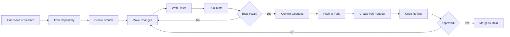
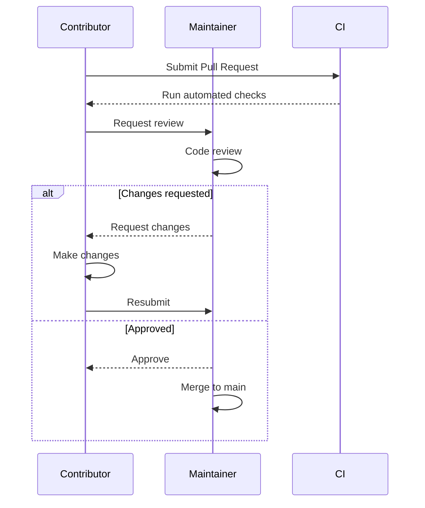

# Contributing Guide

Thank you for your interest in contributing to the Mercado Libre Payment API! This guide provides comprehensive instructions for contributing to the project.

---

## Table of Contents

- [Code of Conduct](#code-of-conduct)
- [Getting Started](#getting-started)
- [How to Contribute](#how-to-contribute)
- [Pull Request Guidelines](#pull-request-guidelines)
- [Coding Standards](#coding-standards)
- [Issue Reporting](#issue-reporting)
- [Development Workflow](#development-workflow)
- [Recognition](#recognition)

---

## Code of Conduct

### Our Pledge

We pledge to make participation in our project a harassment-free experience for everyone. We welcome contributors of all backgrounds and identities.

### Expected Behavior

- Be respectful and inclusive
- Accept constructive criticism
- Focus on what's best for the community
- Show empathy towards others

### Unacceptable Behavior

- Harassment or discrimination
- Offensive comments
- Trolling or insulting
- Publishing others' private information

### Enforcement

Report unacceptable behavior to the project maintainers. All complaints will be reviewed and investigated.

---

## Getting Started

### Prerequisites

Before contributing, ensure you have:

- [ ] Git installed and configured
- [ ] Python 3.8+ installed
- [ ] GitHub account
- [ ] Read the [documentation home](index.md)
- [ ] Reviewed the [Documentation](index.md)

### Fork and Clone

```bash
# 1. Fork the repository on GitHub
# Visit https://github.com/GabrielDLobo/06-API_Pgto_MercadoLivre and click "Fork"

# 2. Clone your fork
git clone https://github.com/YOUR_USERNAME/06-API_Pgto_MercadoLivre.git
cd 06-API_Pgto_MercadoLivre

# 3. Add upstream remote
git remote add upstream https://github.com/GabrielDLobo/06-API_Pgto_MercadoLivre.git

# 4. Verify remotes
git remote -v
# origin    https://github.com/YOUR_USERNAME/06-API_Pgto_MercadoLivre.git (fetch)
# origin    https://github.com/YOUR_USERNAME/06-API_Pgto_MercadoLivre.git (push)
# upstream  https://github.com/GabrielDLobo/06-API_Pgto_MercadoLivre.git (fetch)
# upstream  https://github.com/GabrielDLobo/06-API_Pgto_MercadoLivre.git (push)
```

### Setup Development Environment

```bash
# 1. Create virtual environment
python -m venv venv

# 2. Activate virtual environment
# Windows
venv\Scripts\activate
# macOS/Linux
source venv/bin/activate

# 3. Install dependencies
pip install -r requirements.txt

# 4. Install development dependencies
pip install -r requirements-test.txt

# 5. Create .env file with sandbox credentials
echo MP_BASE_API_URL=https://api.mercadopago.com > .env
echo MP_ACCESS_TOKEN=TEST-your-sandbox-token >> .env
echo DEBUG=True >> .env
```

---

## How to Contribute

### Ways to Contribute

| Type | Description | Examples |
|------|-------------|----------|
| **Code** | Write code for features or fixes | New payment methods, bug fixes |
| **Documentation** | Improve documentation | Fix typos, add examples |
| **Testing** | Write or improve tests | Add test cases, improve coverage |
| **Design** | Improve UI/UX | Better checkout interface |
| **Issues** | Report bugs or suggest features | Detailed bug reports |
| **Review** | Review pull requests | Code review feedback |

### Contribution Flow



---

## Pull Request Guidelines

### Before Submitting

- [ ] Code follows project style guidelines
- [ ] Tests are written and passing
- [ ] Documentation is updated
- [ ] No sensitive data in code
- [ ] Commit messages follow convention
- [ ] Branch is up to date with main

### Pull Request Template

```markdown
## Description
<!-- Describe your changes in detail -->

## Related Issue
<!-- Link to related issue if applicable -->
Fixes #<issue-number>

## Type of Change
<!-- Mark the appropriate option with an [x] -->
- [ ] Bug fix (non-breaking change that fixes an issue)
- [ ] New feature (non-breaking change that adds functionality)
- [ ] Breaking change (fix or feature that would cause existing functionality to change)
- [ ] Documentation update

## Testing
<!-- Describe the tests you ran -->
- [ ] Unit tests pass
- [ ] Integration tests pass
- [ ] Manual testing completed

## Checklist
- [ ] My code follows the style guidelines
- [ ] I have performed a self-review
- [ ] I have commented my code where necessary
- [ ] I have updated the documentation
- [ ] My changes generate no new warnings
- [ ] I have added tests that prove my fix/feature works
- [ ] All tests pass locally
```

### PR Title Format

```
<type>(<scope>): <description>

# Examples
feat(payment): add support for new card brand
fix(validation): correct CPF validation edge case
docs(readme): add deployment instructions
refactor(service): improve error handling
test(api): add integration tests for PIX
```

### Review Process



### Review Time

- **Small PRs** (< 100 lines): 1-2 days
- **Medium PRs** (100-500 lines): 2-4 days
- **Large PRs** (> 500 lines): 4-7 days

---

## Coding Standards

### Python Style Guide

Follow [PEP 8](https://pep8.org/) with these specifics:

```python
# ✅ Good
def create_payment(
    amount: float,
    description: str,
    payment_method: str,
) -> dict:
    """
    Create a new payment transaction.

    Args:
        amount: Transaction amount in BRL
        description: Payment description
        payment_method: Payment method code

    Returns:
        Payment response dictionary

    Raises:
        ValueError: If amount is invalid
    """
    if amount <= 0:
        raise ValueError("Amount must be positive")
    return {"status": "approved"}


# ❌ Bad
def CreatePayment(amount,description,payment_method):
    # bad formatting
    if amount<=0:
        raise Exception("Error")
    return {"status":"approved"}
```

### Type Hints

Use type hints for all function signatures:

```python
# ✅ Good - With type hints
def pay_with_pix(
    amount: float,
    description: str,
    payer: dict,
) -> dict:
    pass

# ❌ Bad - No type hints
def pay_with_pix(amount, description, payer):
    pass
```

### Docstrings

Use Google-style docstrings:

```python
def validate_payment_method(method: str) -> bool:
    """
    Validate if payment method is supported.

    Args:
        method: Payment method code (card, pix, boleto)

    Returns:
        True if method is supported

    Raises:
        ValueError: If method is not supported
    """
    supported = ['card', 'pix', 'boleto']
    if method not in supported:
        raise ValueError(f"Unsupported method: {method}")
    return True
```

### Code Quality Tools

```bash
# Install pre-commit hooks
pip install pre-commit
pre-commit install

# Run linters manually
black app.py services/           # Format code
isort app.py services/           # Sort imports
flake8 app.py services/          # Lint
mypy app.py services/            # Type check

# Run all checks
pre-commit run --all-files
```

---

## Issue Reporting

### Before Creating an Issue

- [ ] Search existing issues (open and closed)
- [ ] Check the documentation
- [ ] Verify the issue exists in the latest version
- [ ] Gather relevant information

### Bug Report Template

```markdown
## Bug Description
<!-- Clear and concise description of the bug -->

## To Reproduce
Steps to reproduce the behavior:
1. Go to '...'
2. Click on '...'
3. Scroll down to '...'
4. See error

## Expected Behavior
<!-- What you expected to happen -->

## Actual Behavior
<!-- What actually happened -->

## Environment
- OS: [e.g., Windows 11, macOS 14, Ubuntu 22.04]
- Python version: [e.g., 3.11.5]
- Package version: [e.g., 1.0.0]

## Screenshots
<!-- If applicable, add screenshots -->

## Additional Context
<!-- Any other context about the problem -->

## Possible Solution
<!-- If you have ideas on how to fix it -->
```

### Feature Request Template

```markdown
## Problem Statement
<!-- What problem does this feature solve? -->

## Proposed Solution
<!-- Describe the solution you'd like -->

## Alternatives Considered
<!-- Any alternative solutions you've considered -->

## Use Case
<!-- Who will use this feature and how? -->

## Additional Context
<!-- Any other context, mockups, or examples -->
```

### Issue Labels

| Label | Description |
|-------|-------------|
| `bug` | Something isn't working |
| `enhancement` | New feature or request |
| `documentation` | Documentation improvements |
| `good first issue` | Good for newcomers |
| `help wanted` | Extra attention needed |
| `question` | Further information needed |
| `wontfix` | Will not be fixed |

---

## Development Workflow

### Branch Naming

```
# Feature branches
feature/add-new-payment-method
feature/improve-error-messages

# Bug fixes
bugfix/fix-pix-validation
bugfix/resolve-token-expiry

# Documentation
docs/add-api-examples
docs/update-installation-guide

# Tests
test/add-integration-tests
test/improve-coverage
```

### Commit Messages

Follow [Conventional Commits](https://www.conventionalcommits.org/):

```
<type>(<scope>): <subject>

<body>

<footer>
```

#### Types

| Type | Description |
|------|-------------|
| `feat` | New feature |
| `fix` | Bug fix |
| `docs` | Documentation |
| `style` | Formatting |
| `refactor` | Code refactoring |
| `test` | Tests |
| `chore` | Maintenance |

#### Examples

```bash
feat(payment): add boleto payment support

Added support for boleto bancario payments.
- New validation for payer address fields
- Integration with boleto API endpoint
- Updated checkout form with boleto option

Closes #42

---

fix(validation): correct CPF validation logic

The CPF validation was rejecting valid numbers.
Updated the algorithm to match official specification.

Fixes #38

---

docs(readme): update installation instructions

Added detailed steps for Windows users.
Included troubleshooting section.
```

### Keeping Branch Updated

```bash
# Fetch upstream changes
git fetch upstream

# Rebase your branch
git checkout main
git merge upstream/main
git checkout your-branch
git rebase main

# Or merge
git checkout your-branch
git merge main
```

---

## Recognition

### Contributors

Contributors are recognized in:

- contributors list file
- Release notes
- Project documentation

### Contribution Levels

| Level | Requirements | Recognition |
|-------|--------------|-------------|
| **First-time** | First merged PR | Welcome message |
| **Contributor** | 3+ merged PRs | Listed in CONTRIBUTORS.md |
| **Regular** | 10+ merged PRs | Featured in release notes |
| **Maintainer** | Consistent contributions | Invite to maintainer team |

---

## Questions?

If you have questions about contributing:

1. Check existing [documentation](index.md)
2. Search closed issues for similar questions
3. Open a new issue with the `question` label
4. Join project discussions (if available)

---

## Thank You!

Every contribution, no matter how small, helps make this project better. We appreciate your time and effort in improving the Mercado Libre Payment API!

---

**Last Updated**: April 2026  
**Version**: 1.0.0
