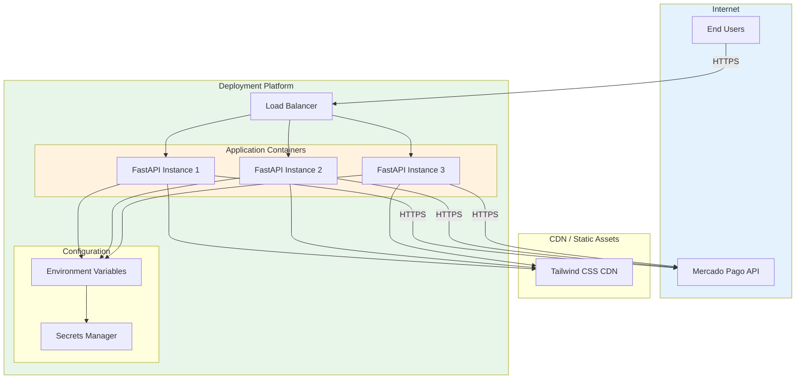

# Deployment Guide

This guide provides comprehensive instructions for deploying the Mercado Libre Payment API to production environments.

---

## Table of Contents

- [Deployment Overview](#deployment-overview)
- [Pre-Deployment Checklist](#pre-deployment-checklist)
- [Deployment Platforms](#deployment-platforms)
- [Docker Deployment](#docker-deployment)
- [Platform-Specific Guides](#platform-specific-guides)
- [Environment Configuration](#environment-configuration)
- [SSL/HTTPS Setup](#sslhttps-setup)
- [Monitoring & Logging](#monitoring--logging)
- [Post-Deployment Verification](#post-deployment-verification)
- [Rollback Procedures](#rollback-procedures)

---

## Deployment Overview

### Deployment Architecture



### Deployment Strategies

| Strategy | Description | Downtime | Complexity |
|----------|-------------|----------|------------|
| **Recreate** | Stop old, start new | Yes | Low |
| **Rolling** | Gradual replacement | No | Medium |
| **Blue-Green** | Two environments | No | High |
| **Canary** | Gradual traffic shift | No | High |

---

## Pre-Deployment Checklist

Before deploying to production, verify:

### Code Quality

- [ ] All tests passing (minimum 85% coverage)
- [ ] Code reviewed and approved
- [ ] No debug statements in code
- [ ] Linting passes (flake8, black, isort)
- [ ] Type checking passes (mypy)

### Security

- [ ] Production access token configured
- [ ] Sandbox tokens removed
- [ ] `.env` file not committed
- [ ] Secrets stored in secure manager
- [ ] HTTPS enabled
- [ ] Security headers configured

### Configuration

- [ ] `DEBUG=False` in production
- [ ] Correct `APP_HOST` and `APP_PORT`
- [ ] Database connections configured (if applicable)
- [ ] Logging configured
- [ ] Rate limiting enabled

### Infrastructure

- [ ] SSL certificate valid
- [ ] Domain configured
- [ ] Firewall rules set
- [ ] Monitoring enabled
- [ ] Backup strategy in place

---

## Deployment Platforms

### Supported Platforms

| Platform | Type | Best For | Pricing |
|----------|------|----------|---------|
| **Render** | PaaS | Small-Medium apps | Free tier available |
| **Railway** | PaaS | Small-Medium apps | Free tier available |
| **Heroku** | PaaS | Medium apps | Paid |
| **AWS Elastic Beanstalk** | PaaS | Enterprise | Pay-as-you-go |
| **Google Cloud Run** | Serverless | Variable traffic | Pay-as-you-go |
| **DigitalOcean App Platform** | PaaS | Small-Medium | Starting $5/mo |
| **VPS (Docker)** | IaaS | Full control | Varies |

---

## Docker Deployment

### Dockerfile

```dockerfile
# Dockerfile
FROM python:3.11-slim

# Set working directory
WORKDIR /app

# Set environment variables
ENV PYTHONDONTWRITEBYTECODE=1 \
    PYTHONUNBUFFERED=1 \
    PIP_NO_CACHE_DIR=1 \
    PIP_DISABLE_PIP_VERSION_CHECK=1

# Install system dependencies
RUN apt-get update && apt-get install -y --no-install-recommends \
    gcc \
    && rm -rf /var/lib/apt/lists/*

# Copy requirements first for better caching
COPY requirements.txt .

# Install Python dependencies
RUN pip install --no-cache-dir -r requirements.txt

# Copy application code
COPY app.py .
COPY services/ ./services/
COPY templates/ ./templates/

# Create non-root user
RUN useradd --create-home --shell /bin/bash app
USER app

# Expose port
EXPOSE 8000

# Health check
HEALTHCHECK --interval=30s --timeout=10s --start-period=5s --retries=3 \
    CMD python -c "import requests; requests.get('http://localhost:8000/')"

# Run application
CMD ["uvicorn", "app:app", "--host", "0.0.0.0", "--port", "8000", "--workers", "4"]
```

### Docker Compose

```yaml
# docker-compose.yml
version: '3.8'

services:
  api:
    build: .
    ports:
      - "8000:8000"
    environment:
      - MP_BASE_API_URL=https://api.mercadopago.com
      - MP_ACCESS_TOKEN=${MP_ACCESS_TOKEN}
      - DEBUG=False
    env_file:
      - .env.production
    restart: unless-stopped
    healthcheck:
      test: ["CMD", "python", "-c", "import requests; requests.get('http://localhost:8000/')"]
      interval: 30s
      timeout: 10s
      retries: 3
      start_period: 10s
    networks:
      - app-network

networks:
  app-network:
    driver: bridge
```

### .dockerignore

```
# .dockerignore
__pycache__/
*.pyc
*.pyo
*.pyd
.env
.env.*
!.env.example
venv/
.venv/
.git
.gitignore
*.md
docs/
tests/
.pytest_cache/
.coverage
htmlcov/
```

### Build and Run

```bash
# Build Docker image
docker build -t mercado-pago-api:latest .

# Run container
docker run -d \
  -p 8000:8000 \
  -e MP_ACCESS_TOKEN=your-production-token \
  -e DEBUG=False \
  --name mp-api \
  mercado-pago-api:latest

# Using Docker Compose
docker-compose up -d

# View logs
docker logs -f mp-api

# Stop container
docker-compose down
```

---

## Platform-Specific Guides

### Render

#### Steps

1. **Create Account**: Sign up at [render.com](https://render.com)

2. **Create Web Service**:
   - Click "New +" → "Web Service"
   - Connect your GitHub repository
   - Configure service settings

3. **Configuration**:

```yaml
# render.yaml
services:
  - type: web
    name: mercado-pago-api
    env: python
    buildCommand: pip install -r requirements.txt
    startCommand: uvicorn app:app --host 0.0.0.0 --port $PORT
    envVars:
      - key: MP_BASE_API_URL
        value: https://api.mercadopago.com
      - key: MP_ACCESS_TOKEN
        sync: false
      - key: DEBUG
        value: false
    healthCheckPath: /
    numInstances: 1
```

4. **Add Environment Variables**:
   - Go to Environment tab
   - Add `MP_ACCESS_TOKEN` (mark as Secret)
   - Add other configuration

5. **Deploy**: Click "Create Web Service"

### Railway

#### Steps

1. **Create Account**: Sign up at [railway.app](https://railway.app)

2. **Deploy from GitHub**:
   - Click "New Project"
   - Select "Deploy from GitHub repo"
   - Choose your repository

3. **Configure**:
   - Railway auto-detects Python
   - Add environment variables

4. **Environment Variables**:
```
MP_BASE_API_URL=https://api.mercadopago.com
MP_ACCESS_TOKEN=your-production-token
DEBUG=False
PORT=8000
```

5. **Deploy**: Railway deploys automatically on push

### Heroku

#### Steps

1. **Create Procfile**:
```
# Procfile
web: uvicorn app:app --host 0.0.0.0 --port $PORT --workers 4
```

2. **Install Heroku CLI**:
```bash
# Login to Heroku
heroku login

# Create app
heroku create your-app-name

# Set environment variables
heroku config:set MP_BASE_API_URL=https://api.mercadopago.com
heroku config:set MP_ACCESS_TOKEN=your-production-token
heroku config:set DEBUG=False

# Deploy
git push heroku main

# Open app
heroku open
```

### AWS Elastic Beanstalk

#### Steps

1. **Create Application Configuration**:
```yaml
# .ebextensions/01_packages.config
packages:
  yum:
    python3-devel: []
    gcc: []

# .ebextensions/02_python.config
option_settings:
  aws:elasticbeanstalk:container:python:
    WSGIPath: app:app
  aws:elasticbeanstalk:application:environment:
    MP_BASE_API_URL: https://api.mercadopago.com
    DEBUG: "false"
```

2. **Deploy**:
```bash
# Install EB CLI
pip install awsebcli

# Initialize
eb init -p python-3.11 mercado-pago-api --region us-east-1

# Create environment
eb create production

# Deploy
eb deploy

# Open
eb open
```

### Google Cloud Run

#### Steps

1. **Build and Push to Container Registry**:
```bash
# Set project
export PROJECT_ID=your-project-id
gcloud config set project $PROJECT_ID

# Build container
gcloud builds submit --tag gcr.io/$PROJECT_ID/mercado-pago-api

# Deploy to Cloud Run
gcloud run deploy mercado-pago-api \
  --image gcr.io/$PROJECT_ID/mercado-pago-api \
  --platform managed \
  --region us-central1 \
  --allow-unauthenticated \
  --set-env-vars MP_BASE_API_URL=https://api.mercadopago.com,DEBUG=false \
  --set-secrets MP_ACCESS_TOKEN=mp-access-token:latest
```

---

## Environment Configuration

### Production Environment Variables

```bash
# .env.production
# =============================================================================
# MERCADO PAGO CONFIGURATION
# =============================================================================
MP_BASE_API_URL=https://api.mercadopago.com
MP_ACCESS_TOKEN=APP_USR-your-production-token-here

# =============================================================================
# APPLICATION CONFIGURATION
# =============================================================================
APP_HOST=0.0.0.0
APP_PORT=8000
DEBUG=False

# =============================================================================
# SECURITY
# =============================================================================
SECRET_KEY=your-secret-key-here
ALLOWED_HOSTS=your-domain.com,www.your-domain.com

# =============================================================================
# LOGGING
# =============================================================================
LOG_LEVEL=INFO
LOG_FORMAT=json

# =============================================================================
# RATE LIMITING
# =============================================================================
RATE_LIMIT_PER_MINUTE=100
```

### Secret Management

| Platform | Secret Management |
|----------|-------------------|
| **Render** | Environment Variables (Secret) |
| **Railway** | Variables (Private) |
| **Heroku** | Config Vars |
| **AWS** | Secrets Manager / Parameter Store |
| **GCP** | Secret Manager |
| **Azure** | Key Vault |

---

## SSL/HTTPS Setup

### Automatic SSL (PaaS)

Most PaaS platforms provide automatic SSL:

| Platform | SSL |
|----------|-----|
| Render | Automatic (Let's Encrypt) |
| Railway | Automatic |
| Heroku | Automatic (with ACM) |
| Cloud Run | Automatic |

### Manual SSL (VPS)

For VPS deployments with Nginx:

```nginx
# /etc/nginx/sites-available/mercado-pago-api
server {
    listen 80;
    server_name your-domain.com;
    return 301 https://$server_name$request_uri;
}

server {
    listen 443 ssl http2;
    server_name your-domain.com;

    ssl_certificate /etc/letsencrypt/live/your-domain.com/fullchain.pem;
    ssl_certificate_key /etc/letsencrypt/live/your-domain.com/privkey.pem;
    
    ssl_protocols TLSv1.2 TLSv1.3;
    ssl_ciphers HIGH:!aNULL:!MD5;
    
    location / {
        proxy_pass http://127.0.0.1:8000;
        proxy_set_header Host $host;
        proxy_set_header X-Real-IP $remote_addr;
        proxy_set_header X-Forwarded-For $proxy_add_x_forwarded_for;
        proxy_set_header X-Forwarded-Proto $scheme;
    }
}
```

### Let's Encrypt Setup

```bash
# Install Certbot
sudo apt install certbot python3-certbot-nginx

# Obtain certificate
sudo certbot --nginx -d your-domain.com -d www.your-domain.com

# Auto-renewal (already configured by Certbot)
sudo certbot renew --dry-run
```

---

## Monitoring & Logging

### Application Logging

```python
# Configure logging for production
import logging
import sys

logging.basicConfig(
    level=logging.INFO,
    format='%(asctime)s - %(name)s - %(levelname)s - %(message)s',
    handlers=[
        logging.StreamHandler(sys.stdout),
    ]
)

logger = logging.getLogger(__name__)
```

### Health Check Endpoint

```python
# app.py
@app.get('/health')
async def health_check():
    """Health check endpoint for monitoring."""
    return {
        'status': 'healthy',
        'service': 'mercado-pago-api',
        'version': '1.0.0'
    }
```

### Monitoring Tools

| Tool | Purpose | Integration |
|------|---------|-------------|
| **New Relic** | APM | Python agent |
| **Datadog** | Monitoring | Python agent |
| **Sentry** | Error tracking | Python SDK |
| **Prometheus** | Metrics | Python client |
| **Grafana** | Dashboards | Prometheus datasource |

### Sentry Integration

```bash
pip install sentry-sdk[fastapi]
```

```python
# app.py
import sentry_sdk
from sentry_sdk.integrations.fastapi import FastApiIntegration

sentry_sdk.init(
    dsn="your-sentry-dsn",
    integrations=[FastApiIntegration()],
    traces_sample_rate=1.0,
    environment="production",
)
```

---

## Post-Deployment Verification

### Verification Checklist

After deployment, verify:

```bash
# 1. Check health endpoint
curl https://your-domain.com/health

# Expected: {"status": "healthy", ...}

# 2. Check main page
curl https://your-domain.com/

# Expected: HTML checkout page

# 3. Test API documentation
curl https://your-domain.com/docs

# Expected: Swagger UI

# 4. Test payment creation (sandbox mode first)
curl -X POST https://your-domain.com/create_payment \
  -H "Content-Type: application/json" \
  -d '{
    "payment_method": "pix",
    "transaction_amount": 1.00,
    "description": "Deployment test",
    "email": "test@example.com",
    "identification_number": "12345678900"
  }'

# Expected: Payment response with status
```

### Monitoring Dashboard

Verify monitoring shows:

- [ ] Application is up
- [ ] Response times are acceptable (< 500ms)
- [ ] Error rate is low (< 1%)
- [ ] Memory usage is normal
- [ ] CPU usage is normal

---

## Rollback Procedures

### Docker Rollback

```bash
# List previous images
docker images mercado-pago-api

# Stop current container
docker stop mp-api
docker rm mp-api

# Run previous version
docker run -d \
  -p 8000:8000 \
  --name mp-api \
  mercado-pago-api:previous-tag
```

### Platform Rollback

#### Render

1. Go to service dashboard
2. Click "Deployments"
3. Select previous version
4. Click "Rollback"

#### Heroku

```bash
# List releases
heroku releases

# Rollback to previous
heroku rollback

# Rollback to specific version
heroku rollback v42
```

#### Railway

1. Go to project dashboard
2. Click "Deployments"
3. Select previous deployment
4. Click "Redeploy"

### Rollback Checklist

- [ ] Identify issue requiring rollback
- [ ] Notify team members
- [ ] Execute rollback procedure
- [ ] Verify service is healthy
- [ ] Monitor for issues
- [ ] Document incident
- [ ] Create post-mortem

---

## Production Best Practices

### DO's ✅

1. **Use production tokens** - Never use sandbox in production
2. **Enable HTTPS** - Always use SSL/TLS
3. **Set DEBUG=False** - Disable debug mode
4. **Implement logging** - Log all transactions
5. **Set up monitoring** - Track errors and performance
6. **Use environment variables** - Never hardcode secrets
7. **Enable health checks** - For load balancers
8. **Configure backups** - Regular data backups
9. **Set up alerts** - Get notified of issues
10. **Document procedures** - Runbooks for common tasks

### DON'Ts ❌

1. **Don't skip testing** - Always test before deploying
2. **Don't deploy on Friday** - Avoid weekend incidents
3. **Don't ignore logs** - Monitor application logs
4. **Don't skip SSL** - Never run production without HTTPS
5. **Don't hardcode secrets** - Use secret management
6. **Don't ignore alerts** - Respond to monitoring alerts
7. **Don't skip rollback plan** - Always have rollback ready
8. **Don't deploy without monitoring** - Watch metrics during deploy

---

## Next Steps

1. [Contributing Guide](contributing.md) - Contribution guidelines
2. [Release Notes](release-notes.md) - Version history
3. [API Endpoints](api-endpoints.md) - API reference

---

**Last Updated**: April 2026  
**Version**: 1.0.0
