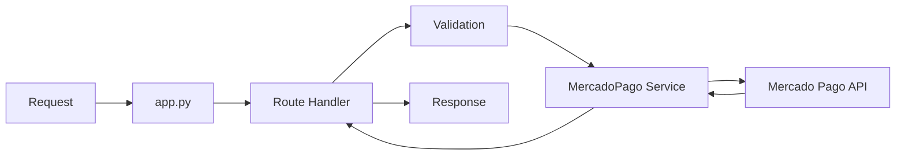
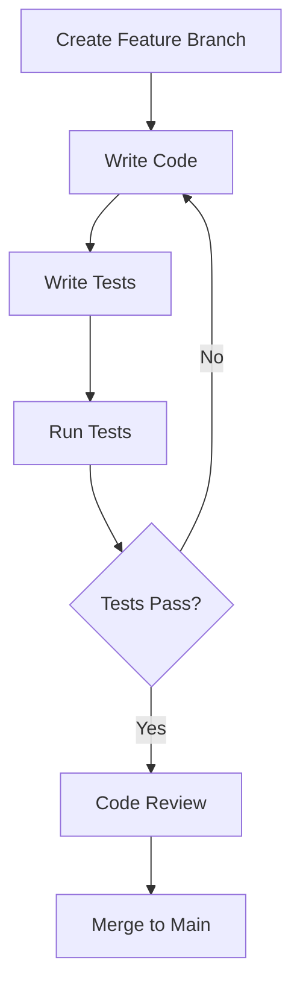
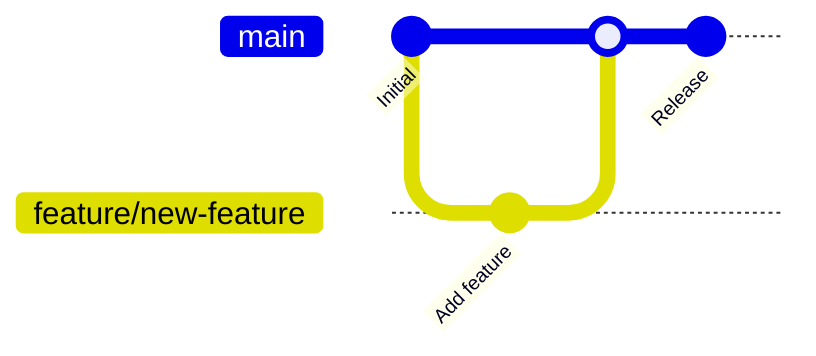

# Development Guide

This guide provides comprehensive instructions for developing features, debugging, and maintaining the Mercado Libre Payment API.

---

## Table of Contents

- [Development Environment Setup](#development-environment-setup)
- [Running the Application](#running-the-application)
- [Code Structure](#code-structure)
- [Adding New Features](#adding-new-features)
- [Debugging](#debugging)
- [Hot Reload](#hot-reload)
- [API Documentation](#api-documentation)
- [Version Control](#version-control)
- [Code Quality](#code-quality)

---

## Development Environment Setup

### Prerequisites Checklist

Before starting development, ensure you have:

- [ ] Python 3.8+ installed
- [ ] Git installed and configured
- [ ] Code editor (VS Code, PyCharm, etc.)
- [ ] Mercado Pago developer account
- [ ] Sandbox access token

### Initial Setup

```bash
# 1. Clone the repository
git clone https://github.com/GabrielDLobo/06-API_Pgto_MercadoLivre.git
cd 06-API_Pgto_MercadoLivre

# 2. Create virtual environment
python -m venv venv

# 3. Activate virtual environment
# Windows (Command Prompt)
venv\Scripts\activate
# Windows (PowerShell)
venv\Scripts\Activate.ps1
# macOS/Linux
source venv/bin/activate

# 4. Install dependencies
pip install -r requirements.txt

# 5. Create .env file with sandbox credentials
echo MP_BASE_API_URL=https://api.mercadopago.com > .env
echo MP_ACCESS_TOKEN=TEST-your-token >> .env
echo DEBUG=True >> .env
```

### Recommended Extensions (VS Code)

| Extension | Purpose |
|-----------|---------|
| **Python** | Python language support |
| **Pylance** | Type checking |
| **Black Formatter** | Code formatting |
| **isort** | Import sorting |
| **GitLens** | Git integration |
| **REST Client** | API testing |

---

## Running the Application

### Development Server

```bash
# Start with auto-reload
uvicorn app:app --reload --host 0.0.0.0 --port 8000
```

### Server Options

| Option | Description | Example |
|--------|-------------|---------|
| `--reload` | Auto-reload on code changes | Enabled for development |
| `--host` | Network interface | `0.0.0.0` or `127.0.0.1` |
| `--port` | Port number | `8000` (default) |
| `--log-level` | Logging verbosity | `debug`, `info`, `warning` |

### Development Commands

```bash
# Standard development
uvicorn app:app --reload

# With debug logging
uvicorn app:app --reload --log-level debug

# Custom port
uvicorn app:app --reload --port 8001

# Production-like (no reload)
uvicorn app:app --host 0.0.0.0 --port 8000
```

---

## Code Structure

### Application Flow



### File Responsibilities

| File | Responsibility |
|------|----------------|
| `app.py` | Routes, request/response handling |
| `services/mercadopago.py` | Business logic, API integration |
| `templates/checkout.html` | Payment UI |
| `.env` | Configuration (not committed) |

---

## Adding New Features

### Feature Development Workflow



### Step 1: Create Feature Branch

```bash
# Create and switch to new branch
git checkout -b feature/add-new-payment-method

# Branch naming conventions:
# feature/<feature-name>
# bugfix/<bug-description>
# docs/<documentation-update>
# refactor/<refactoring-description>
```

### Step 2: Implement Feature

Example: Adding a new payment method validation:

```python
# services/mercadopago.py

def validate_payment_method(self, method: str) -> bool:
    """
    Validate if payment method is supported.
    
    Args:
        method: Payment method code
        
    Returns:
        True if method is supported
        
    Raises:
        ValueError: If method is not supported
    """
    supported_methods = ['card', 'pix', 'boleto']
    if method not in supported_methods:
        raise ValueError(f"Unsupported payment method: {method}")
    return True
```

### Step 3: Update Routes

```python
# app.py

@app.post('/create_payment')
async def create_payment(request: Request):
    data = await request.json()
    method = data.get('payment_method')
    
    # Validate payment method
    mp.validate_payment_method(method)
    
    # ... rest of implementation
```

### Step 4: Write Tests

```python
# tests/test_mercadopago.py

def test_validate_payment_method_supported():
    mp = MercadoPago()
    assert mp.validate_payment_method('card') == True
    assert mp.validate_payment_method('pix') == True
    assert mp.validate_payment_method('boleto') == True

def test_validate_payment_method_unsupported():
    mp = MercadoPago()
    with pytest.raises(ValueError):
        mp.validate_payment_method('crypto')
```

---

## Debugging

### Python Debugger (pdb)

```python
# Set breakpoint
import pdb; pdb.set_trace()

# Or in Python 3.7+
breakpoint()

# Example usage
def create_payment(amount: float):
    breakpoint()  # Execution stops here
    if amount <= 0:
        raise ValueError("Invalid amount")
    return process_payment(amount)
```

### Common pdb Commands

| Command | Description |
|---------|-------------|
| `n` (next) | Execute next line |
| `s` (step) | Step into function |
| `c` (continue) | Continue execution |
| `l` (list) | Show code context |
| `p <var>` | Print variable value |
| `q` (quit) | Quit debugger |

### Logging for Debugging

```python
import logging

# Configure logging
logging.basicConfig(level=logging.DEBUG)
logger = logging.getLogger(__name__)

# Debug logging
logger.debug(f"Payment amount: {amount}")
logger.info(f"Payment created: {payment_id}")
logger.warning(f"Deprecated method called")
logger.error(f"Payment failed: {error}")
```

### Debug Mode

Enable debug mode in `.env`:

```env
DEBUG=True
```

Access interactive debugger at:
- Swagger UI: `http://localhost:8000/docs`
- ReDoc: `http://localhost:8000/redoc`

---

## Hot Reload

### Auto-Reload Configuration

The `--reload` flag enables automatic server restart on code changes:

```bash
uvicorn app:app --reload
```

### Watched Directories

By default, Uvicorn watches:

- `*.py` files in current directory
- Changes trigger server restart

### Reload Troubleshooting

If hot reload isn't working:

```bash
# Explicitly specify reload directory
uvicorn app:app --reload --reload-dir .

# Increase reload delay (default: 0.25s)
uvicorn app:app --reload --reload-delay 0.5
```

---

## API Documentation

### Interactive Documentation

FastAPI auto-generates interactive API docs:

| Documentation | URL | Features |
|---------------|-----|----------|
| **Swagger UI** | `/docs` | Try-it-out, schemas |
| **ReDoc** | `/redoc` | Clean documentation |

### Swagger UI Features

1. **Try it out** - Test endpoints directly
2. **Request/Response schemas** - View data models
3. **Authentication** - Configure tokens
4. **Download spec** - OpenAPI JSON/YAML

### Example: Testing via Swagger

1. Navigate to `http://localhost:8000/docs`
2. Click on `POST /create_payment`
3. Click "Try it out"
4. Fill in request body
5. Click "Execute"
6. View response

---

## Version Control

### Git Workflow



### Commit Message Format

```bash
# Format
<type>(<scope>): <subject>

# Examples
feat(payment): add boleto payment support
fix(validation): correct CPF validation logic
docs(readme): update installation instructions
refactor(service): extract card tokenization method
test(payment): add integration tests for PIX
```

### Common Git Commands

```bash
# Check status
git status

# Stage changes
git add <file>
git add .  # All changes

# Commit
git commit -m "feat: add new feature"

# Push to remote
git push origin feature/branch-name

# Pull latest changes
git pull origin main

# Create pull request (GitHub CLI)
gh pr create --title "feat: add new feature" --body "Description"
```

---

## Code Quality

### Pre-commit Hooks

Install pre-commit for automatic code quality checks:

```bash
# Install pre-commit
pip install pre-commit

# Create .pre-commit-config.yaml
cat > .pre-commit-config.yaml << EOF
repos:
  - repo: https://github.com/psf/black
    rev: 24.0.0
    hooks:
      - id: black
  - repo: https://github.com/pycqa/flake8
    rev: 7.0.0
    hooks:
      - id: flake8
  - repo: https://github.com/pycqa/isort
    rev: 5.13.0
    hooks:
      - id: isort
EOF

# Install git hooks
pre-commit install
```

### Running Linters Manually

```bash
# Format code with black
black app.py services/

# Sort imports with isort
isort app.py services/

# Lint with flake8
flake8 app.py services/

# Type check with mypy
mypy app.py services/
```

### Code Quality Checklist

Before committing:

- [ ] Code formatted with black
- [ ] Imports sorted with isort
- [ ] No flake8 warnings
- [ ] Type hints added
- [ ] Docstrings for public functions
- [ ] Tests written and passing
- [ ] No sensitive data in code
- [ ] Commit message follows convention

---

## Development Tips

### Tip 1: Use Test Cards

For testing credit card payments:

```python
# Test card data (Sandbox)
TEST_CARD = {
    'card_number': '5031755734530604',
    'expiration_month': '11',
    'expiration_year': '2025',
    'security_code': '123',
    'cardholder_name': 'Test User',
}
```

### Tip 2: Mock External Services

For unit testing without API calls:

```python
from unittest.mock import patch, MagicMock

@patch('services.mercadopago.requests.post')
def test_payment_creation(mock_post):
    mock_response = MagicMock()
    mock_response.json.return_value = {'id': '123', 'status': 'approved'}
    mock_response.raise_for_status.return_value = None
    mock_post.return_value = mock_response
    
    result = mp.pay_with_pix(100.0, "Test", payer)
    assert result['status'] == 'approved'
```

### Tip 3: Environment-Specific Config

```python
# Use different configs for dev/prod
from decouple import config

DEBUG = config('DEBUG', default=False, cast=bool)

if DEBUG:
    # Development settings
    MP_ACCESS_TOKEN = config('MP_SANDBOX_TOKEN')
else:
    # Production settings
    MP_ACCESS_TOKEN = config('MP_PRODUCTION_TOKEN')
```

### Tip 4: Request Timing

```python
import time
from functools import wraps

def timing(func):
    @wraps(func)
    def wrapper(*args, **kwargs):
        start = time.time()
        result = func(*args, **kwargs)
        end = time.time()
        print(f"{func.__name__} took {end - start:.2f}s")
        return result
    return wrapper

@timing
def create_payment(...):
    pass
```

---

## Troubleshooting

### Common Development Issues

#### Issue 1: Module Not Found

```bash
# Error: ModuleNotFoundError: No module named 'fastapi'

# Solution: Activate virtual environment and reinstall
venv\Scripts\activate  # Windows
source venv/bin/activate  # macOS/Linux
pip install -r requirements.txt
```

#### Issue 2: Port Already in Use

```bash
# Error: OSError: [Errno 48] Address already in use

# Solution: Find and kill process or use different port
# Windows
netstat -ano | findstr :8000
taskkill /PID <PID> /F

# macOS/Linux
lsof -i :8000
kill -9 <PID>

# Or use different port
uvicorn app:app --reload --port 8001
```

#### Issue 3: Hot Reload Not Working

```bash
# Solution: Check file system events
# Some systems need explicit reload directory
uvicorn app:app --reload --reload-dir .

# Or increase delay
uvicorn app:app --reload --reload-delay 0.5
```

#### Issue 4: Environment Variables Not Loading

```bash
# Verify .env file exists
ls -la .env

# Check file encoding (should be UTF-8)
# Verify variable names match exactly
cat .env

# Restart server after .env changes
```

---

## Next Steps

1. [Testing Guide](testing.md) - Write and run tests
2. [Deploy Guide](deploy.md) - Deploy to production
3. [Contributing Guide](contributing.md) - Contribution guidelines

---

**Last Updated**: April 2026  
**Version**: 1.0.0
