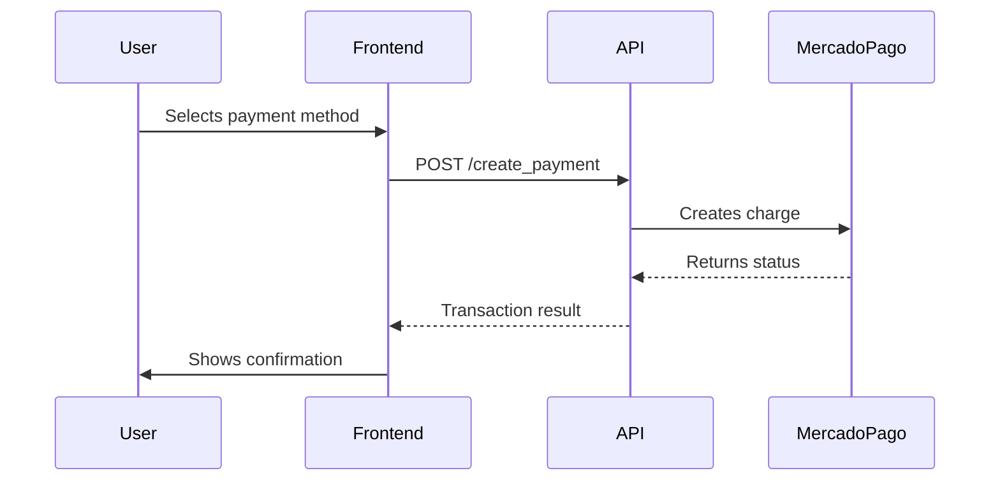

# Mercado Pago Payment API

Documentation for the FastAPI payment integration with Mercado Pago.

<div class="page-hero">
   <div class="hero-copy">
      <p class="hero-eyebrow">FastAPI + Mercado Pago</p>
      <h1>Online payments with a clear, secure, and fast flow</h1>
      <p>
         Central documentation for the payment project integrated with Mercado Pago.
         Find installation, configuration, endpoints, security, testing, and deployment in one place.
      </p>
      <div class="hero-actions">
         <a class="md-button md-button--primary" href="installation.md">Get started</a>
         <a class="md-button" href="api-endpoints.md">View endpoints</a>
         <a class="md-button" href="system-modeling.md">Architecture</a>
      </div>
   </div>
   <div class="hero-panel">
      <div class="hero-stat">
         <span class="hero-stat__value">3</span>
         <span class="hero-stat__label">payment methods</span>
      </div>
      <div class="hero-stat">
         <span class="hero-stat__value">1</span>
         <span class="hero-stat__label">checkout-focused API</span>
      </div>
      <div class="hero-stat">
         <span class="hero-stat__value">100%</span>
         <span class="hero-stat__label">navigable documentation</span>
      </div>
   </div>
</div>

## Overview

<div class="grid cards metric-grid" markdown>

- :material-credit-card-check-outline: **Unified checkout**

   Card, PIX, and boleto with a consistent front-end flow.

- :material-shield-check-outline: **Built-in security**

   Token handling, input validation, and error handling in the integration.

- :material-flash-outline: **Real-time response**

   Fast feedback to confirm transaction status.

- :material-api: **Structured REST integration**

   Separate endpoints for checkout, lookup, and operations.

</div>

## Documentation Index

<div class="grid cards" markdown>

- **Getting Started**

   Install the project, configure your environment, and run the API locally.

   [Installation](installation.md)  
   [Configuration](configuration.md)  
   [Development](development.md)

- **API & Security**

   Review the request flow, endpoint reference, and security guidance.

   [API Endpoints](api-endpoints.md)  
   [Authentication and Security](authentication-security.md)  
   [System Modeling](system-modeling.md)

- **Quality & Delivery**

   Standards, testing, deployment, and release notes.

   [Guidelines and Standards](guidelines.md)  
   [Testing](testing.md)  
   [Deploy](deploy.md)  
   [Contributing](contributing.md)  
   [Release Notes](release-notes.md)

</div>

## Quick Start

```bash
git clone https://github.com/GabrielDLobo/06-API_Pgto_MercadoLivre.git
cd 06-API_Pgto_MercadoLivre
pip install -r requirements.txt
uvicorn app:app --reload --host 0.0.0.0 --port 8000
```

::: details Interactive API docs

- Swagger UI: `http://localhost:8000/docs`
- ReDoc: `http://localhost:8000/redoc`

:::

## Browse the documentation

<div class="grid cards doc-grid" markdown>

- **Installation and setup**

   [Installation](installation.md)  
   [Configuration](configuration.md)  
   [Development](development.md)

- **Architecture and API**

   [API Endpoints](api-endpoints.md)  
   [Authentication and Security](authentication-security.md)  
   [System Modeling](system-modeling.md)

- **Best practices and operations**

   [Guidelines and Standards](guidelines.md)  
   [Testing](testing.md)  
   [Deploy](deploy.md)

- **Contribution and history**

   [Contributing](contributing.md)  
   [Release Notes](release-notes.md)

</div>

## Payment Flow



   ## Tech Stack

   | Layer | Technology |
|---|---|
| Backend | FastAPI 0.115.12 |
   | Server | Uvicorn 0.34.2 |
   | Validation | Pydantic 2.11.4 |
   | HTTP Client | Requests 2.32.3 |
| Templates | Jinja2 3.1.6 |
   | Configuration | python-decouple 3.8 |

   ## Useful Shortcuts

<div class="highlight-box">
   <strong>Repository:</strong> <a href="https://github.com/GabrielDLobo/06-API_Pgto_MercadoLivre" target="_blank" rel="noopener noreferrer">06-API_Pgto_MercadoLivre</a><br>
   <strong>Local docs:</strong> `mkdocs serve -a 127.0.0.1:8001`<br>
   <strong>Local API:</strong> `uvicorn app:app --reload --host 0.0.0.0 --port 8000`
</div>

## Repository

<a href="https://github.com/GabrielDLobo/06-API_Pgto_MercadoLivre" target="_blank" rel="noopener noreferrer">06-API_Pgto_MercadoLivre</a>
