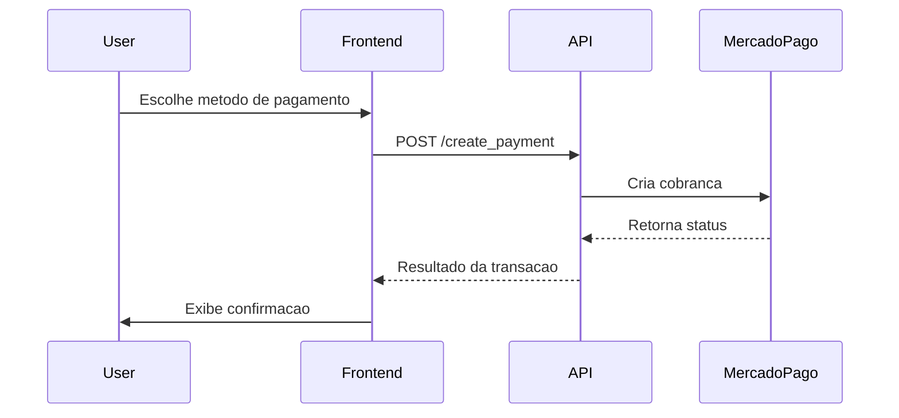

# Mercado Pago Payment API

<div class="hero">
   <h1>Pagamentos online com foco em velocidade e seguranca</h1>
   <p>
      Documentacao oficial da API de pagamentos com FastAPI e Mercado Pago.
      Encontre rapidamente como instalar, configurar e operar o fluxo completo
      de checkout com cartao, PIX e boleto.
   </p>
   <div class="hero-buttons">
      <a class="md-button md-button--primary" href="installation.md">Comecar agora</a>
      <a class="md-button" href="api-endpoints.md">Ver endpoints</a>
      <a class="md-button" href="system-modeling.md">Arquitetura</a>
   </div>
</div>

## Visao Geral

<div class="grid cards kpi-grid" markdown>

- :material-credit-card-check-outline: **3 metodos de pagamento**

   Cartao, PIX e boleto com fluxo unificado.

- :material-shield-check-outline: **Seguranca aplicada**

   Integracao com token, validacoes e tratamento de erros.

- :material-flash-outline: **Resposta em tempo real**

   Processamento rapido com retorno claro para o front-end.

- :material-api: **API REST pronta para integracao**

   Endpoints organizados para checkout e acompanhamento.

</div>

## Navegue pela documentacao

<div class="grid cards" markdown>

- **Instalacao e configuracao**

   [Prerequisites](installation.md#prerequisites)  
   [Installation](installation.md)  
   [Configuration](configuration.md)

- **Arquitetura e API**

   [Project Structure](project-structure.md)  
   [API Endpoints](api-endpoints.md)  
   [System Modeling](system-modeling.md)

- **Boas praticas e desenvolvimento**

   [Guidelines](guidelines.md)  
   [Development](development.md)  
   [Testing](testing.md)

- **Entrega e contribuicao**

   [Deploy](deploy.md)  
   [Contributing](contributing.md)  
   [Release Notes](release-notes.md)

</div>

## Quick Start

```bash
git clone https://github.com/GabrielDLobo/06-API_Pgto_MercadoLivre.git
cd 06-API_Pgto_MercadoLivre
pip install -r requirements.txt
uvicorn app:app --reload --host 0.0.0.0 --port 8000
```

::: details Endpoints de documentacao interativa

- Swagger UI: `http://localhost:8000/docs`
- ReDoc: `http://localhost:8000/redoc`

:::

## Fluxo de Pagamento



## Stack Tecnologica

| Camada | Tecnologia |
|---|---|
| Backend | FastAPI 0.115.12 |
| Servidor | Uvicorn 0.34.2 |
| Validacao | Pydantic 2.11.4 |
| Cliente HTTP | Requests 2.32.3 |
| Templates | Jinja2 3.1.6 |
| Configuracao | python-decouple 3.8 |

<div class="highlight-box">
<strong>Repositorio:</strong> <a href="https://github.com/GabrielDLobo/06-API_Pgto_MercadoLivre">06-API_Pgto_MercadoLivre</a><br>
<strong>Versao:</strong> 1.0.0<br>
<strong>Atualizado em:</strong> Abril 2026
</div>
