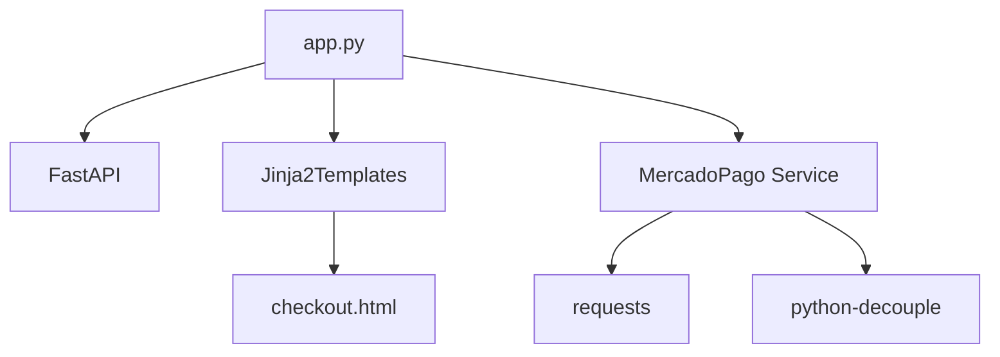

# Project Structure

This document describes the directory structure and file organization of the Mercado Libre Payment API project.

---

## Table of Contents

- [Overview](#overview)
- [Directory Tree](#directory-tree)
- [Root Files](#root-files)
- [Directories](#directories)
- [File Descriptions](#file-descriptions)
- [Module Organization](#module-organization)

---

## Overview

The project follows a clean, modular structure that separates concerns between API routes, business logic, and presentation layers.

```
06-API_Pgto_MercadoLivre/
├── app.py                    # Main FastAPI application
├── requirements.txt          # Python dependencies
├── README.md                 # Project readme
├── .gitignore               # Git ignore rules
├── .env                     # Environment variables (not committed)
├── services/                # Business logic layer
│   ├── __init__.py         # Package initialization
│   └── mercadopago.py      # Mercado Pago integration
├── templates/               # HTML templates
│   └── checkout.html       # Payment checkout page
└── docs/                    # Documentation
    ├── index.md            # Documentation home
    ├── installation.md     # Installation guide
    ├── configuration.md    # Configuration guide
    └── ...                 # Other documentation files
```

---

## Directory Tree

```
C:\Users\Gabri\OneDrive\GitHub\06-API_Pgto_MercadoLivre\
│
├── 📄 .gitignore              # Git ignore configuration
├── 📄 app.py                  # Main application entry point
├── 📄 README.md               # Project overview and quick start
├── 📄 requirements.txt        # Python package dependencies
│
├── 📁 .git/                   # Git repository data
│
├── 📁 __pycache__/            # Python bytecode cache (auto-generated)
│
├── 📁 services/               # Service layer (business logic)
│   ├── 📄 __init__.py        # Package export file
│   ├── 📄 mercadopago.py     # Mercado Pago API client
│   └── 📁 __pycache__/       # Compiled Python files
│
├── 📁 templates/              # HTML template files
│   └── 📄 checkout.html      # Payment form template
│
├── 📁 venv/                   # Python virtual environment
│   ├── Scripts/              # Windows virtual env scripts
│   ├── Lib/                  # Python libraries
│   └── pyvenv.cfg            # Virtual env configuration
│
└── 📁 docs/                   # Project documentation
    ├── 📄 index.md           # Documentation home
    ├── 📄 installation.md    # Installation instructions
    ├── 📄 configuration.md   # Configuration guide
    ├── 📄 guidelines.md      # Coding standards
    ├── 📄 project-structure.md # This file
    ├── 📄 api-endpoints.md   # API reference
    ├── 📄 system-modeling.md # Architecture diagrams
    ├── 📄 authentication-security.md # Security docs
    ├── 📄 development.md     # Development guide
    ├── 📄 testing.md         # Testing documentation
    ├── 📄 deploy.md          # Deployment guide
    ├── 📄 contributing.md    # Contribution guidelines
    ├── 📄 release-notes.md   # Version history
    └── 📁 images/            # Documentation images
```

---

## Root Files

### `app.py`

**Purpose**: Main FastAPI application file containing all API routes and request handlers.

**Responsibilities**:
- FastAPI application initialization
- Route definitions (endpoints)
- Request/Response handling
- Template rendering
- Service layer integration

**Key Components**:
```python
from fastapi import FastAPI, Request
from fastapi.templating import Jinja2Templates
from services import MercadoPago

app = FastAPI()
templates = Jinja2Templates(directory='templates')
mp = MercadoPago()
```

---

### `requirements.txt`

**Purpose**: Lists all Python package dependencies for the project.

**Contents**:
```
fastapi==0.115.12
uvicorn==0.34.2
pydantic==2.11.4
requests==2.32.3
Jinja2==3.1.6
python-decouple==3.8
starlette==0.46.2
...
```

**Usage**:
```bash
pip install -r requirements.txt
```

---

### `README.md`

**Purpose**: Project overview, features, and quick start guide.

**Sections**:
- Project description
- Main features
- Technologies used
- Installation instructions
- API endpoints overview
- Configuration guide
- Security considerations

---

### `.gitignore`

**Purpose**: Specifies files and directories that Git should ignore.

**Typical Contents**:
```
# Python
__pycache__/
*.py[cod]
*.env
venv/
.env

# IDE
.vscode/
.idea/
*.swp

# OS
.DS_Store
Thumbs.db
```

---

## Directories

### `services/`

**Purpose**: Contains business logic and external service integrations.

| File | Description |
|------|-------------|
| `__init__.py` | Package initialization and exports |
| `mercadopago.py` | Mercado Pago API client implementation |

#### `services/__init__.py`

Exports the `MercadoPago` class for easy importing:

```python
from .mercadopago import MercadoPago

__all__ = ['MercadoPago']
```

#### `services/mercadopago.py`

**Purpose**: Implements the Mercado Pago API client.

**Class**: `MercadoPago`

**Methods**:
| Method | Visibility | Description |
|--------|------------|-------------|
| `__init__` | Public | Initialize with API credentials |
| `__post` | Private | Generic POST request handler |
| `__get_card_token` | Private | Tokenize credit card data |
| `__create_payment` | Private | Create payment in Mercado Pago |
| `pay_with_card` | Public | Process credit card payment |
| `pay_with_pix` | Public | Process PIX payment |
| `pay_with_boleto` | Public | Process boleto payment |

---

### `templates/`

**Purpose**: Contains HTML templates rendered by Jinja2.

| File | Description |
|------|-------------|
| `checkout.html` | Payment checkout form with multiple payment methods |

#### `templates/checkout.html`

**Features**:
- Responsive design with Tailwind CSS
- Multiple payment method selection (Card, PIX, Boleto)
- Dynamic form fields based on payment method
- Loading states and success/error feedback
- AJAX payment submission

**Technologies**:
- HTML5
- Tailwind CSS (via CDN)
- Vanilla JavaScript
- Fetch API

---

### `venv/`

**Purpose**: Python virtual environment for dependency isolation.

**Structure**:
```
venv/
├── Scripts/           # Executables (Windows)
│   ├── activate       # Activation script
│   ├── python.exe     # Python interpreter
│   └── pip.exe        # Package installer
├── Lib/              # Installed packages
│   └── site-packages/
└── pyvenv.cfg        # Configuration file
```

**Note**: This directory is excluded from version control via `.gitignore`.

---

### `docs/`

**Purpose**: Project documentation in Markdown format.

| File | Description |
|------|-------------|
| `index.md` | Documentation home page |
| `installation.md` | Installation and setup guide |
| `configuration.md` | Configuration instructions |
| `guidelines.md` | Coding standards and guidelines |
| `project-structure.md` | This file - project organization |
| `api-endpoints.md` | API endpoint reference |
| `system-modeling.md` | Architecture and flow diagrams |
| `authentication-security.md` | Security documentation |
| `development.md` | Development workflow guide |
| `testing.md` | Testing procedures |
| `deploy.md` | Deployment instructions |
| `contributing.md` | Contribution guidelines |
| `release-notes.md` | Version history and changelog |
| `images/` | Images used in documentation |

---

## File Descriptions

### Configuration Files

| File | Purpose |
|------|---------|
| `.env` | Environment variables (local, not committed) |
| `.gitignore` | Git ignore rules |
| `requirements.txt` | Python dependencies |

### Source Code Files

| File | Purpose | Lines (approx) |
|------|---------|----------------|
| `app.py` | Main application | ~80 |
| `services/__init__.py` | Package exports | ~5 |
| `services/mercadopago.py` | API client | ~70 |
| `templates/checkout.html` | Payment UI | ~150 |

---

## Module Organization

### Import Structure

```
app.py
├── fastapi (framework)
├── Jinja2Templates (templating)
└── services.mercadopago (business logic)

services/mercadopago.py
├── requests (HTTP client)
├── uuid (idempotency)
└── decouple (configuration)
```

### Dependency Flow



---

## Architecture Layers

```
┌─────────────────────────────────────┐
│         Presentation Layer          │
│         (templates/checkout.html)   │
└─────────────────┬───────────────────┘
                  │
                  ▼
┌─────────────────────────────────────┐
│           API Layer                 │
│           (app.py)                  │
│   - Routes                          │
│   - Request/Response Handling       │
│   - Validation                      │
└─────────────────┬───────────────────┘
                  │
                  ▼
┌─────────────────────────────────────┐
│         Service Layer               │
│         (services/mercadopago.py)   │
│   - Business Logic                  │
│   - External API Integration        │
│   - Error Handling                  │
└─────────────────┬───────────────────┘
                  │
                  ▼
┌─────────────────────────────────────┐
│      External Services              │
│      (Mercado Pago API)             │
└─────────────────────────────────────┘
```

---

## File Naming Conventions

| Type | Convention | Example |
|------|------------|---------|
| **Python modules** | snake_case | `mercadopago.py` |
| **HTML templates** | snake_case | `checkout.html` |
| **Documentation** | kebab-case | `project-structure.md` |
| **Configuration** | dot prefix | `.gitignore`, `.env` |
| **Packages** | snake_case | `services/` |

---

## Code Organization Principles

The project follows these organizational principles:

1. **Separation of Concerns**: API routes separate from business logic
2. **Single Responsibility**: Each module has one clear purpose
3. **Modularity**: Services can be reused across different routes
4. **Encapsulation**: Private methods prefixed with `__`
5. **Explicit Exports**: `__all__` defines public API

---

## Next Steps

1. [API Endpoints](api-endpoints.md) - Explore available endpoints
2. [System Modeling](system-modeling.md) - Understand architecture diagrams
3. [Development Guide](development.md) - Start developing features

---

**Last Updated**: April 2026  
**Version**: 1.0.0
