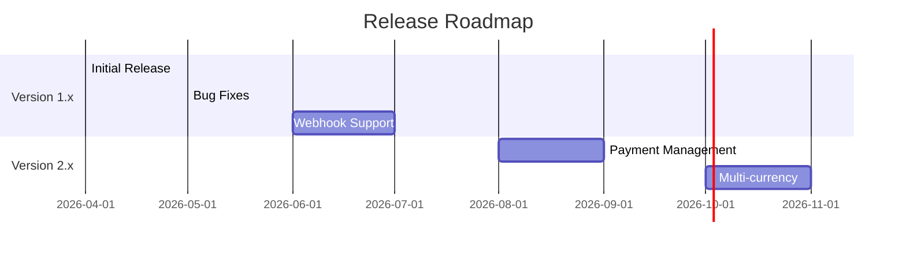

# Release Notes

This document contains the release notes and changelog for the Mercado Libre Payment API.

---

## Table of Contents

- [Versioning](#versioning)
- [Releases](#releases)
  - [Unreleased](#unreleased)
  - [Version 1.0.0](#version-100)
- [Release Planning](#release-planning)
- [Upgrade Guide](#upgrade-guide)

---

## Versioning

This project follows [Semantic Versioning](https://semver.org/):

```
MAJOR.MINOR.PATCH
  │     │     │
  │     │     └─ Bug fixes (backward compatible)
  │     └─────── New features (backward compatible)
  └───────────── Breaking changes
```

### Version Numbers

| Component | When to Increment |
|-----------|-------------------|
| **MAJOR** | Breaking changes |
| **MINOR** | New features (backward compatible) |
| **PATCH** | Bug fixes (backward compatible) |

---

## Releases

### Unreleased

#### Planned Features

- [ ] Add webhook endpoint for payment notifications
- [ ] Implement payment cancellation endpoint
- [ ] Add payment status lookup endpoint
- [ ] Support for recurring payments
- [ ] Add refund functionality
- [ ] Implement payment search endpoint

#### Under Consideration

- Support for additional payment methods
- Multi-currency support
- Payment link generation
- Subscription management

---

### Version 1.0.0

**Release Date**: April 1, 2026

**Type**: Initial Release

#### Features

##### Payment Processing

- **Credit Card Payments**
  - Card tokenization for security
  - Support for multiple installments (1-12x)
  - Major card brands: Visa, Mastercard, Elo, Amex, Hipercard
  - Real-time approval/rejection

- **PIX Payments**
  - Instant payment via QR Code
  - Copy & Paste support
  - Real-time transaction confirmation
  - Automatic payment status updates

- **Boleto Payments**
  - Bank slip generation
  - External payment URL
  - Support for Bradesco boleto
  - Complete payer address validation

##### API Endpoints

| Endpoint | Method | Description |
|----------|--------|-------------|
| `/` | GET | Checkout page |
| `/create_payment` | POST | Create payment transaction |

##### Payment Methods

```python
# Supported payment methods
payment_methods = {
    'card': 'Credit Card',
    'pix': 'PIX (Instant Payment)',
  'boleto': 'Bank Slip',
}
```

#### Technical Features

##### Backend

- **FastAPI Framework**
  - Async request handling
  - Automatic API documentation (Swagger/ReDoc)
  - Request validation with Pydantic
  - Type hints throughout codebase

- **Service Architecture**
  - Separated business logic
  - Mercado Pago API integration
  - Error handling and propagation
  - Idempotency support

##### Frontend

- **Checkout Page**
  - Responsive design (Tailwind CSS)
  - Dynamic form fields per payment method
  - Loading states and animations
  - Success/error feedback
  - AJAX payment submission

##### Security

- **Authentication**
  - Bearer token authentication
  - Environment-based credential management
  - Sandbox and production token support

- **Data Protection**
  - Card data tokenization
  - No sensitive data storage
  - HTTPS/TLS encryption
  - Input validation and sanitization

- **Request Security**
  - Idempotency keys (UUID)
  - Error message sanitization
  - Secure logging practices

#### Configuration

##### Environment Variables

```env
# Required
MP_BASE_API_URL=https://api.mercadopago.com
MP_ACCESS_TOKEN=your-access-token

# Optional
APP_HOST=0.0.0.0
APP_PORT=8000
DEBUG=True
```

##### Dependencies

| Package | Version | Purpose |
|---------|---------|---------|
| fastapi | 0.115.12 | Web framework |
| uvicorn | 0.34.2 | ASGI server |
| pydantic | 2.11.4 | Data validation |
| requests | 2.32.3 | HTTP client |
| Jinja2 | 3.1.6 | Template engine |
| python-decouple | 3.8 | Configuration |

#### Documentation

- Complete API documentation
- Installation guide
- Configuration guide
- Development guide
- Testing guide
- Deployment guide
- Security documentation
- System modeling diagrams

#### Testing

- Unit tests for service layer
- Integration tests for API endpoints
- Test fixtures and mocks
- Coverage reporting
- Test card data for sandbox

#### Known Issues

| Issue | Workaround | Status |
|-------|------------|--------|
| No webhook support | Poll payment status manually | Planned |
| No cancellation endpoint | Cancel via Mercado Pago dashboard | Planned |
| Single currency (BRL) | Convert before API call | Under consideration |

#### Contributors

- Initial development and release

---

## Release Planning

### Roadmap



### Upcoming Releases

#### Version 1.1.0 (Planned: June 2026)

**Theme**: Webhook Support

- [ ] Webhook endpoint for payment notifications
- [ ] Payment status update handling
- [ ] Notification signature validation
- [ ] Retry logic for failed webhooks

#### Version 1.2.0 (Planned: July 2026)

**Theme**: Payment Management

- [ ] Payment cancellation endpoint
- [ ] Payment status lookup
- [ ] Payment search functionality
- [ ] Refund processing

#### Version 2.0.0 (Planned: August 2026)

**Theme**: Advanced Features

- [ ] Recurring payments / Subscriptions
- [ ] Payment links generation
- [ ] Customer management
- [ ] Multi-currency support (breaking changes)

---

## Upgrade Guide

### From No Previous Version (First Install)

This is the initial release. Follow the [Installation Guide](installation.md) for setup.

```bash
# Clone repository
git clone https://github.com/GabrielDLobo/06-API_Pgto_MercadoLivre.git
cd 06-API_Pgto_MercadoLivre

# Install dependencies
pip install -r requirements.txt

# Configure environment
cp .env.example .env
# Edit .env with your credentials

# Run application
uvicorn app:app --reload
```

### Future Upgrades

#### Version 1.1.0 Upgrade

When version 1.1.0 is released:

```bash
# Pull latest changes
git pull origin main

# Install updated dependencies
pip install -r requirements.txt

# New environment variable required
echo WEBHOOK_SECRET=your-secret >> .env

# Restart application
uvicorn app:app --reload
```

---

## Breaking Changes

### Version 1.0.0

No breaking changes (initial release).

### Future Breaking Changes

The following are planned for future major versions:

#### Version 2.0.0 Planned Changes

1. **API Endpoint Changes**
   - `/create_payment` → `/api/v1/payments`
   - New RESTful URL structure

2. **Request/Response Format**
   - Standardized response envelope
   - Consistent error format

3. **Configuration Changes**
   - New environment variables required
   - Deprecated variables removed

---

## Bug Fixes

### Version 1.0.0

As the initial release, known issues are documented for future fixes:

| Issue ID | Description | Status |
|----------|-------------|--------|
| BUG-001 | No webhook support | Planned for 1.1.0 |
| BUG-002 | No cancellation endpoint | Planned for 1.2.0 |
| BUG-003 | Single currency support | Under consideration |

---

## Security Updates

### Version 1.0.0

Security features included in initial release:

- ✅ Card data tokenization
- ✅ Environment-based secrets
- ✅ Input validation
- ✅ HTTPS support
- ✅ Idempotency keys
- ✅ Secure logging

### Security Advisories

No security advisories at this time.

To report a security issue:
1. Do not create a public issue
2. Email the maintainer directly
3. Allow time for fix before disclosure

---

## Deprecation Notices

### Version 1.0.0

No deprecations (initial release).

### Future Deprecations

The following may be deprecated in future versions:

| Feature | Deprecated In | Removal In | Replacement |
|---------|---------------|------------|-------------|
| TBA | - | - | - |

---

## Migration Guide

### Migrating from Other Payment Solutions

#### From Stripe

```python
# Stripe
# stripe.PaymentIntent.create(amount=1000, currency='brl')

# Mercado Pago
mp.pay_with_pix(amount=10.00, description='Payment', payer=payer)
```

#### From PayPal

```python
# PayPal
# payment = paypal.Payment({...})

# Mercado Pago
result = mp.pay_with_card(
    amount=amount,
    installments=1,
    description=description,
    card_data=card_data,
    payer=payer,
)
```

---

## Support

### Getting Help

- **Documentation**: [docs/index.md](index.md)
- **Issues**: [GitHub Issues](https://github.com/GabrielDLobo/06-API_Pgto_MercadoLivre/issues)
- **Discussions**: [GitHub Discussions](https://github.com/GabrielDLobo/06-API_Pgto_MercadoLivre/discussions)

### Reporting Issues

When reporting issues, include:

1. Version number
2. Environment details
3. Steps to reproduce
4. Expected vs actual behavior
5. Relevant logs or screenshots

---

## Changelog Summary

### Statistics

| Metric | Count |
|--------|-------|
| **Total Releases** | 1 |
| **Major Releases** | 1 |
| **Minor Releases** | 0 |
| **Patch Releases** | 0 |
| **Total Features** | 15+ |
| **Total Bug Fixes** | N/A |

### Release Timeline

| Version | Release Date | Days Since Last |
|---------|--------------|-----------------|
| 1.0.0 | April 1, 2026 | - |

---

## License

This project is open source. See the repository root for licensing details.

---

**Last Updated**: April 2026  
**Current Version**: 1.0.0
