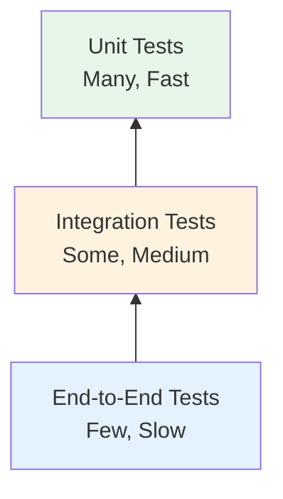

# Testing Guide

This guide covers testing strategies, frameworks, and procedures for the Mercado Libre Payment API.

---

## Table of Contents

- [Testing Overview](#testing-overview)
- [Test Environment Setup](#test-environment-setup)
- [Unit Testing](#unit-testing)
- [Integration Testing](#integration-testing)
- [End-to-End Testing](#end-to-end-testing)
- [Test Cards and Data](#test-cards-and-data)
- [Running Tests](#running-tests)
- [Test Coverage](#test-coverage)
- [CI/CD Integration](#cicd-integration)

---

## Testing Overview

### Testing Pyramid



### Test Types

| Type | Purpose | Speed | Coverage |
|------|---------|-------|----------|
| **Unit Tests** | Test individual functions | Fast | High |
| **Integration Tests** | Test component interactions | Medium | Medium |
| **E2E Tests** | Test complete user flows | Slow | Low |

### Testing Framework

The project uses **pytest** as the testing framework:

| Feature | Description |
|---------|-------------|
| Simple syntax | Easy to write tests |
| Fixtures | Reusable test setup |
| Parametrization | Run tests with multiple inputs |
| Plugins | Extensive ecosystem |

---

## Test Environment Setup

### Install Testing Dependencies

```bash
# Create test requirements file
cat > requirements-test.txt << EOF
-r requirements.txt
pytest==8.0.0
pytest-cov==4.1.0
pytest-asyncio==0.23.0
httpx==0.27.0
EOF

# Install testing dependencies
pip install -r requirements-test.txt
```

### Test Directory Structure

```
tests/
├── __init__.py
├── conftest.py          # Pytest fixtures and configuration
├── test_app.py          # API endpoint tests
├── test_mercadopago.py  # Service layer tests
└── test_integration.py  # Integration tests
```

### Test Configuration (conftest.py)

```python
# tests/conftest.py
import pytest
from unittest.mock import MagicMock, patch
from fastapi.testclient import TestClient
from app import app

@pytest.fixture
def client():
    """Create test client."""
    with TestClient(app) as test_client:
        yield test_client

@pytest.fixture
def mock_mercadopago():
    """Mock MercadoPago service."""
    with patch('app.MercadoPago') as mock:
        mp_instance = MagicMock()
        mock.return_value = mp_instance
        yield mp_instance

@pytest.fixture
def valid_card_data():
    """Valid test card data."""
    return {
        'payment_method': 'card',
        'transaction_amount': 100.00,
        'description': 'Test Payment',
        'email': 'test@example.com',
        'card_number': '5031755734530604',
        'expiration_month': '11',
        'expiration_year': '2025',
        'security_code': '123',
        'cardholder_name': 'Test User',
        'identification_number': '12345678900',
        'installments': 1,
    }

@pytest.fixture
def valid_pix_data():
    """Valid test PIX data."""
    return {
        'payment_method': 'pix',
        'transaction_amount': 50.00,
        'description': 'Test PIX',
        'email': 'pix@example.com',
        'identification_number': '12345678900',
    }

@pytest.fixture
def valid_boleto_data():
    """Valid test boleto data."""
    return {
        'payment_method': 'boleto',
        'transaction_amount': 75.00,
        'description': 'Test Boleto',
        'email': 'boleto@example.com',
        'first_name': 'Test',
        'last_name': 'User',
        'identification_number': '12345678900',
        'zip_code': '01001-000',
        'street_name': 'Test Street',
        'street_number': '100',
        'neighborhood': 'Centro',
        'city': 'Sao Paulo',
        'federal_unit': 'SP',
    }
```

---

## Unit Testing

### Service Layer Tests

```python
# tests/test_mercadopago.py
import pytest
from unittest.mock import patch, MagicMock
from services.mercadopago import MercadoPago

class TestMercadoPago:
    """Tests for MercadoPago service."""
    
    @patch('services.mercadopago.requests.post')
    def test_pay_with_pix_success(self, mock_post):
        """Test successful PIX payment creation."""
        # Arrange
        mock_response = MagicMock()
        mock_response.json.return_value = {
            'id': '123456',
            'status': 'pending',
            'payment_method_id': 'pix'
        }
        mock_response.raise_for_status.return_value = None
        mock_post.return_value = mock_response
        
        mp = MercadoPago()
        payer = {'email': 'test@example.com'}
        
        # Act
        result = mp.pay_with_pix(
            amount=100.00,
            description='Test Payment',
            payer=payer
        )
        
        # Assert
        assert result['id'] == '123456'
        assert result['status'] == 'pending'
        assert result['payment_method_id'] == 'pix'
        mock_post.assert_called_once()
    
    @patch('services.mercadopago.requests.post')
    def test_pay_with_card_tokenization(self, mock_post):
        """Test card tokenization before payment."""
        # Arrange
        token_response = MagicMock()
        token_response.json.return_value = {'id': 'token_123'}
        token_response.raise_for_status.return_value = None
        
        payment_response = MagicMock()
        payment_response.json.return_value = {
            'id': '789012',
            'status': 'approved'
        }
        payment_response.raise_for_status.return_value = None
        
        mock_post.side_effect = [token_response, payment_response]
        
        mp = MercadoPago()
        card_data = {'card_number': '5031755734530604'}
        payer = {'email': 'test@example.com'}
        
        # Act
        result = mp.pay_with_card(
            amount=100.00,
            installments=1,
            description='Test',
            card_data=card_data,
            payer=payer
        )
        
        # Assert
        assert result['status'] == 'approved'
        assert mock_post.call_count == 2  # Token + Payment
    
    @patch('services.mercadopago.requests.post')
    def test_api_error_handling(self, mock_post):
        """Test API error handling."""
        # Arrange
        mock_response = MagicMock()
        mock_response.json.return_value = {
            'message': 'Invalid card',
            'error': 'bad_request'
        }
        mock_response.raise_for_status.side_effect = Exception("HTTP Error")
        mock_post.return_value = mock_response
        
        mp = MercadoPago()
        
        # Act & Assert
        with pytest.raises(RuntimeError):
            mp.pay_with_pix(100.00, 'Test', {'email': 'test@example.com'})
```

### Input Validation Tests

```python
# tests/test_validation.py
import pytest
from app import app
from fastapi.testclient import TestClient

client = TestClient(app)

class TestPaymentValidation:
    """Tests for payment input validation."""
    
    def test_invalid_payment_method(self):
        """Test rejection of invalid payment method."""
        response = client.post('/create_payment', json={
            'payment_method': 'crypto',
            'transaction_amount': 100.00,
            'description': 'Test',
            'email': 'test@example.com'
        })
        assert response.status_code == 400
        assert 'payment method' in response.json()['detail'].lower()
    
    def test_negative_amount(self):
        """Test rejection of negative amounts."""
        response = client.post('/create_payment', json={
            'payment_method': 'pix',
            'transaction_amount': -50.00,
            'description': 'Test',
            'email': 'test@example.com'
        })
        assert response.status_code == 400
    
    def test_zero_amount(self):
        """Test rejection of zero amounts."""
        response = client.post('/create_payment', json={
            'payment_method': 'pix',
            'transaction_amount': 0,
            'description': 'Test',
            'email': 'test@example.com'
        })
        assert response.status_code == 400
    
    def test_missing_required_field(self):
        """Test rejection when required field is missing."""
        response = client.post('/create_payment', json={
            'payment_method': 'pix',
            'transaction_amount': 100.00,
            # Missing description
            'email': 'test@example.com'
        })
        # Should handle gracefully or return appropriate error
        assert response.status_code in [200, 400, 422]
    
    def test_invalid_email_format(self):
        """Test handling of invalid email format."""
        response = client.post('/create_payment', json={
            'payment_method': 'pix',
            'transaction_amount': 100.00,
            'description': 'Test',
            'email': 'invalid-email'
        })
        # Application should validate email format
        assert response.status_code in [200, 400]
```

---

## Integration Testing

### API Endpoint Tests

```python
# tests/test_app.py
import pytest
from fastapi.testclient import TestClient
from unittest.mock import patch, MagicMock
from app import app

client = TestClient(app)

class TestCheckoutPage:
    """Tests for checkout page endpoint."""
    
    def test_checkout_page_loads(self):
        """Test that checkout page renders successfully."""
        response = client.get('/')
        assert response.status_code == 200
        assert 'text/html' in response.headers['content-type']
        assert b'Checkout' in response.content
    
    def test_checkout_contains_payment_methods(self):
        """Test that checkout page shows all payment methods."""
        response = client.get('/')
        assert response.status_code == 200
        assert b'Credit Card' in response.content or b'card' in response.content
        assert b'PIX' in response.content or b'pix' in response.content
        assert b'Boleto' in response.content or b'boleto' in response.content


class TestCreatePayment:
    """Tests for payment creation endpoint."""
    
    @patch('app.MercadoPago')
    def test_create_card_payment_success(self, mock_mp_class):
        """Test successful credit card payment creation."""
        # Arrange
        mock_mp = MagicMock()
        mock_mp.pay_with_card.return_value = {
            'id': '123456',
            'status': 'approved',
            'transaction_amount': 100.00
        }
        mock_mp_class.return_value = mock_mp
        
        # Act
        response = client.post('/create_payment', json={
            'payment_method': 'card',
            'transaction_amount': 100.00,
            'description': 'Test Payment',
            'email': 'test@example.com',
            'card_number': '5031755734530604',
            'expiration_month': '11',
            'expiration_year': '2025',
            'security_code': '123',
            'cardholder_name': 'Test User',
            'identification_number': '12345678900',
            'installments': 1,
        })
        
        # Assert
        assert response.status_code == 200
        data = response.json()
        assert data['status'] == 'approved'
        assert data['id'] == '123456'
    
    @patch('app.MercadoPago')
    def test_create_pix_payment_success(self, mock_mp_class):
        """Test successful PIX payment creation."""
        # Arrange
        mock_mp = MagicMock()
        mock_mp.pay_with_pix.return_value = {
            'id': '789012',
            'status': 'pending',
            'payment_method_id': 'pix',
            'point_of_interaction': {
                'transaction_data': {
                    'qr_code': '00020126580014BR.GOV.BCB.PIX...',
                    'ticket_url': 'https://mercadopago.com.br/pix/...'
                }
            }
        }
        mock_mp_class.return_value = mock_mp
        
        # Act
        response = client.post('/create_payment', json={
            'payment_method': 'pix',
            'transaction_amount': 50.00,
            'description': 'Test PIX',
            'email': 'pix@example.com',
            'identification_number': '12345678900',
        })
        
        # Assert
        assert response.status_code == 200
        data = response.json()
        assert data['status'] == 'pending'
        assert 'point_of_interaction' in data
    
    @patch('app.MercadoPago')
    def test_create_boleto_payment_success(self, mock_mp_class):
        """Test successful boleto payment creation."""
        # Arrange
        mock_mp = MagicMock()
        mock_mp.pay_with_boleto.return_value = {
            'id': '345678',
            'status': 'pending',
            'payment_method_id': 'bolbradesco',
            'transaction_details': {
                'external_resource_url': 'https://mercadopago.com.br/boleto/...'
            }
        }
        mock_mp_class.return_value = mock_mp
        
        # Act
        response = client.post('/create_payment', json={
            'payment_method': 'boleto',
            'transaction_amount': 75.00,
            'description': 'Test Boleto',
            'email': 'boleto@example.com',
            'first_name': 'Test',
            'last_name': 'User',
            'identification_number': '12345678900',
            'zip_code': '01001-000',
            'street_name': 'Test Street',
            'street_number': '100',
            'neighborhood': 'Centro',
            'city': 'Sao Paulo',
            'federal_unit': 'SP',
        })
        
        # Assert
        assert response.status_code == 200
        data = response.json()
        assert data['status'] == 'pending'
        assert 'external_resource_url' in data.get('transaction_details', {})
    
    @patch('app.MercadoPago')
    def test_payment_creation_error(self, mock_mp_class):
        """Test payment creation error handling."""
        # Arrange
        mock_mp = MagicMock()
        mock_mp.pay_with_pix.side_effect = RuntimeError("API Error")
        mock_mp_class.return_value = mock_mp
        
        # Act
        response = client.post('/create_payment', json={
            'payment_method': 'pix',
            'transaction_amount': 100.00,
            'description': 'Test',
            'email': 'test@example.com',
            'identification_number': '12345678900',
        })
        
        # Assert
        assert response.status_code == 502
```

---

## End-to-End Testing

### Full Payment Flow Test

```python
# tests/test_e2e.py
import pytest
from fastapi.testclient import TestClient
from app import app

client = TestClient(app)

class TestEndToEndPaymentFlow:
    """End-to-end tests for complete payment flows."""
    
    def test_complete_pix_payment_flow(self):
        """Test complete PIX payment flow from start to finish."""
        # Step 1: Load checkout page
        page_response = client.get('/')
        assert page_response.status_code == 200
        
        # Step 2: Create PIX payment
        payment_response = client.post('/create_payment', json={
            'payment_method': 'pix',
            'transaction_amount': 100.00,
            'description': 'E2E Test Payment',
            'email': 'e2e@example.com',
            'identification_number': '12345678900',
        })
        
        # Step 3: Verify payment response
        assert payment_response.status_code == 200
        payment_data = payment_response.json()
        assert 'id' in payment_data
        assert payment_data['status'] in ['pending', 'approved']
        
        # Step 4: Verify QR code or ticket URL is present
        if payment_data['payment_method_id'] == 'pix':
            assert 'point_of_interaction' in payment_data
    
    def test_payment_method_selection(self):
        """Test that all payment methods are available."""
        response = client.get('/')
        assert response.status_code == 200
        
        # Verify page contains all payment method options
        content = response.content.decode()
        assert 'card' in content.lower() or 'credit card' in content.lower()
        assert 'pix' in content.lower()
        assert 'boleto' in content.lower()
```

---

## Test Cards and Data

### Mercado Pago Test Cards (Sandbox)

Use these test cards in sandbox mode:

#### Approved Payments

| Card Type | Card Number | CVV | Expiration |
|-----------|-------------|-----|------------|
| **Visa** | 4013 5406 8274 6224 | 123 | 11/25 |
| **Mastercard** | 5031 7557 3453 0604 | 123 | 11/25 |
| **Elo** | 5066 9920 6000 0004 | 123 | 11/25 |

#### Rejected Payments

| Card Type | Card Number | CVV | Expiration | Reason |
|-----------|-------------|-----|------------|--------|
| **Visa** | 4013 5406 8274 6224 | 123 | 11/25 | General rejection |
| **Mastercard** | 5031 4332 1540 6351 | 123 | 11/25 | Insufficient funds |

### Test Data Fixtures

```python
# tests/test_data.py

# Valid CPF numbers (for testing only)
VALID_CPFS = [
    '12345678900',
    '98765432100',
    '11144477735',
]

# Valid test addresses
TEST_ADDRESSES = {
    'sp': {
        'zip_code': '01001-000',
        'street_name': 'Se Square',
        'street_number': '100',
        'neighborhood': 'Se',
        'city': 'Sao Paulo',
        'federal_unit': 'SP',
    },
    'rj': {
        'zip_code': '20000-000',
        'street_name': 'Av. Rio Branco',
        'street_number': '500',
        'neighborhood': 'Centro',
        'city': 'Rio de Janeiro',
        'federal_unit': 'RJ',
    },
}

# Test emails
TEST_EMAILS = {
    'approved': 'approved@test.com',
    'rejected': 'rejected@test.com',
    'pending': 'pending@test.com',
}
```

---

## Running Tests

### Basic Test Commands

```bash
# Run all tests
pytest

# Run with verbose output
pytest -v

# Run specific test file
pytest tests/test_app.py

# Run specific test class
pytest tests/test_app.py::TestCreatePayment

# Run specific test function
pytest tests/test_app.py::TestCreatePayment::test_create_pix_payment_success

# Run tests matching a pattern
pytest -k "pix"
pytest -k "card"
```

### Test with Coverage

```bash
# Run tests with coverage report
pytest --cov=app --cov=services --cov-report=html

# Run with terminal coverage report
pytest --cov=app --cov=services --cov-report=term-missing

# Run with coverage and fail below threshold
pytest --cov=app --cov-fail-under=80
```

### Test Output Options

```bash
# Generate JUnit XML report
pytest --junitxml=test-results.xml

# Generate HTML report
pytest --html=report.html

# Show local variables on failure
pytest -l

# Show print statements
pytest -s
```

---

## Test Coverage

### Coverage Report Example

```
Name                        Stmts   Miss  Cover   Missing
---------------------------------------------------------
app.py                         45      2    96%   75-77
services/mercadopago.py        52      3    94%   45-47
---------------------------------------------------------
TOTAL                          97      5    95%
```

### Coverage Goals

| Component | Minimum Coverage |
|-----------|------------------|
| **Services** | 90% |
| **API Routes** | 85% |
| **Overall** | 85% |

### Coverage Configuration (pyproject.toml)

```toml
[tool.pytest.ini_options]
addopts = "--cov=app --cov=services --cov-report=html --cov-report=term-missing"

[tool.coverage.run]
source = ["app.py", "services/"]
omit = ["tests/*", "venv/*"]

[tool.coverage.report]
exclude_lines = [
    "pragma: no cover",
    "def __repr__",
    "raise AssertionError",
    "raise NotImplementedError",
]
```

---

## CI/CD Integration

### GitHub Actions Workflow

```yaml
# .github/workflows/tests.yml
name: Tests

on:
  push:
    branches: [main, develop]
  pull_request:
    branches: [main]

jobs:
  test:
    runs-on: ubuntu-latest
    
    steps:
    - uses: actions/checkout@v4
    
    - name: Set up Python
      uses: actions/setup-python@v5
      with:
        python-version: '3.11'
    
    - name: Install dependencies
      run: |
        python -m pip install --upgrade pip
        pip install -r requirements.txt
        pip install -r requirements-test.txt
    
    - name: Run tests with coverage
      run: |
        pytest --cov=app --cov=services --cov-report=xml --cov-report=term-missing
    
    - name: Upload coverage to Codecov
      uses: codecov/codecov-action@v3
      with:
        file: ./coverage.xml
```

### Pre-commit Test Hook

```yaml
# .pre-commit-config.yaml
repos:
  - repo: local
    hooks:
      - id: pytest
        name: pytest
        entry: pytest
        language: system
        pass_filenames: false
        always_run: true
```

---

## Test Best Practices

### DO's ✅

1. **Use descriptive test names** - `test_pay_with_pix_success()`
2. **Follow AAA pattern** - Arrange, Act, Assert
3. **Mock external services** - Don't call real API in unit tests
4. **Test edge cases** - Invalid inputs, boundary values
5. **Keep tests independent** - No test should depend on another
6. **Use fixtures** - Reusable test setup
7. **Assert specific values** - Not just status codes

### DON'Ts ❌

1. **Don't use real credentials** in tests
2. **Don't make real API calls** in unit tests
3. **Don't test implementation details** - Test behavior
4. **Don't skip tests** without reason
5. **Don't hardcode sensitive data** in test files

---

## Next Steps

1. [Deploy Guide](deploy.md) - Deploy to production
2. [Contributing Guide](contributing.md) - Contribution guidelines
3. [Release Notes](release-notes.md) - Version history

---

**Last Updated**: April 2026  
**Version**: 1.0.0
